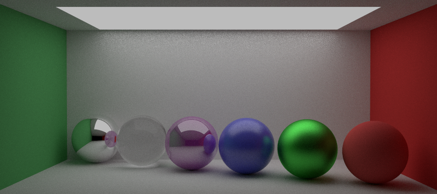

# RaytracingRenderer

## Overview
This project is a **C++ Ray Tracing Engine** developed as part of a ray tracing course. The base project, including scene management, was provided by the professor.

The implementation follows a physically-based rendering (PBR) approach and covers essential techniques for ray tracing, including intersection calculations, material shading, and advanced sampling methods.

Final Render           |  Some materials
:-------------------------:|:-------------------------:
  |  

In this engine I implemented the following features:

## Features Implemented
- **Ray Generation & Camera Transformations**
  - Perspective camera model
  - Homogeneous coordinate transformations
- **Basic Shape Intersections**
  - Spheres
  - Triangles (Möller–Trumbore Algorithm)
  - Meshes with BVH acceleration
- **Materials & Shading Models**
  - Lambertian (Diffuse)
  - Specular Reflection (Metallic)
  - Dielectric (Glass-like materials)
  - Fresnel Blending
- **Texture Mapping**
  - UV Coordinate mapping
  - Procedural textures (Checkerboard, Perlin Noise)
- **Light Transport**
  - Direct Lighting with Multiple Importance Sampling (MIS)
  - Path Tracing
  - Emissive materials
- **Sampling Techniques**
  - Hemisphere sampling (Cosine-weighted, uniform, Phong)
  - BSDF importance sampling
  - Light source sampling (Quad, Sphere, Triangle)
  - Monte Carlo integration

On top of those features, I implemented **Ray bending from the air refraction**, this allowed to render mirage,
As  well as **Instancing** and procedural **Dune generation **
